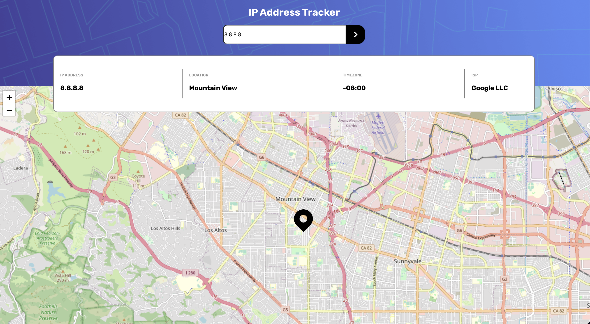
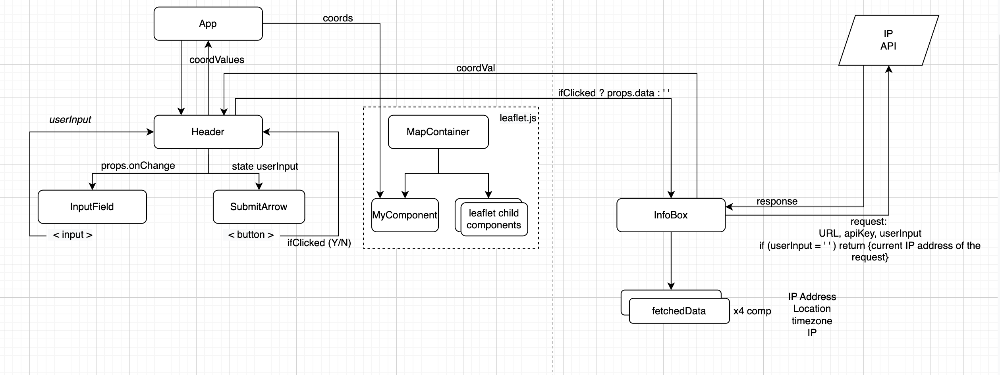

# Frontend Mentor - IP address tracker solution

This is a solution to the [IP address tracker challenge on Frontend Mentor](https://www.frontendmentor.io/challenges/ip-address-tracker-I8-0yYAH0). Frontend Mentor challenges help you improve your coding skills by building realistic projects. 

**developed by Mehmet Alptekin Isiklar**

## Table of contents

- [Frontend Mentor - IP address tracker solution](#frontend-mentor---ip-address-tracker-solution)
  - [Table of contents](#table-of-contents)
  - [Overview](#overview)
    - [The challenge](#the-challenge)
    - [snapshot of the app](#snapshot-of-the-app)
    - [Links](#links)
  - [My process](#my-process)
    - [Built with](#built-with)
    - [app architecture](#app-architecture)
    - [Notes on this challenge](#notes-on-this-challenge)
    - [Continued development](#continued-development)

## Overview

### The challenge

Users should be able to:

- View the optimal layout for each page depending on their device's screen size
- See hover states for all interactive elements on the page
- See their own IP address on the map on the initial page load
- Search for any IP addresses or domains and see the key information and location

### snapshot of the app

### Links

- Solution URL: https://github.com/aisiklar/IP-Address-Tracker-FE-Mentor 
- Live Site URL: https://ip-address-tracker-ai.netlify.app

## My process

### Built with
* react.js library

### app architecture
The react component architecture is as follows.

### Notes on this challenge

This exercise was very beneficial in improving my skills in reactjs, javascript and general development strategies. 

I find drawing a component architecture very useful, even in this (not so complex) react application. 

I made use of useEffect() hook especially to prevent "infinite rendering". However, passing in dependencies was challenge, especially when these are objects / arrays. 

Additionally, had spent quite time in integrating the react-leaflet library. Especially in changing the map coord upon first launch or user input. I solved the problem through lib documentation and stackoverflow searches.

### Continued development

The ip tracker API has a free-tier query limit of 1000... Which is certainly not enough. 
Therefore, in my future project, I might find another free-API service.
If I find a new API, then I might re-develop the project and add new features to this project and even maybe convert it to PWA.

